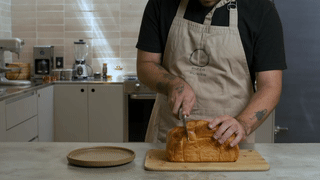
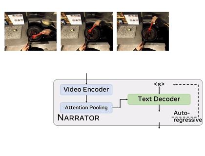
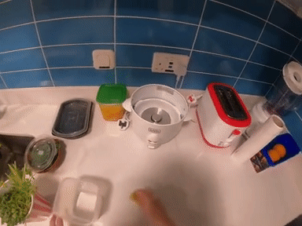
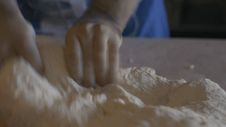
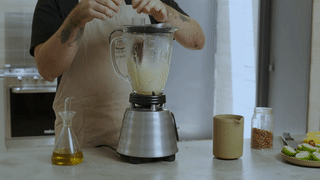

# Learning Video Representations from Large Language Models


[**Learning Video Representations from Large Language Models**](http://arxiv.org/abs/2212.04501)                                     
Yue Zhao, Ishan Misra, Philipp Kr&auml;henb&uuml;hl, Rohit Girdhar                 
CVPR 2023 (**Highlight**, acceptance rate≈2.5%)                 
[arxiv](http://arxiv.org/abs/2212.04501) | [bibtex](#citing-lavila) | [colab](#narrator-demo) | [🤗 demo](https://huggingface.co/spaces/nateraw/lavila) | [website](http://facebookresearch.github.io/LaViLa)

LaViLa (**L**anguage **a**ugmented **Vi**deo **La**nguage Pretraining) is a new approach to learning video representations from Large Language Models (LLMs). We repurpose LLMs to be visually conditioned "Narrators", and use them to automatically generate video-language paired data. We use this data to then learn a video-langauge representation, outperforming prior work by large margins.

**Sample Generations:**

| Video | Generation 1 | Generation 2 |
| --------|-------------|--------------|
|  | so now we're going to slice the bread | now i'm going to do is just slice<br>this up into a nice chunk and<br>then we're going to place it<br>on the plate |

[Try out](#narrator-demo) our Narrator to generate text descriptions for your own videos! 
You can also try out a web demo here: [](https://huggingface.co/spaces/nateraw/lavila)

The resulting video-language model sets a new **state-of-the-art** on a number of popular video tasks!


## Introduction and installation

<span style="font-variant:small-caps;">LaViLa</span> leverages Large Language Models (LLMs) as "NARRATOR"s (and "REPHRASER"s) to densely narrate long videos, and uses these narrations to train strong dual-encoder models.


 

See [INSTALL.md](docs/INSTALL.md) to install this code.

## NARRATOR

NARRATOR is a *visually conditioned* LLM that takes videos frames as input and pseudo-labels this clip with narrations.




### NARRATOR Demo

We provide some generated samples by our NARRATOR:

|                    |  |  | 
| :----------------: | :----------------------------------------: | :-------------------------------------: | :--------------------------------------: |
| Human<br>narration |  C separates the yarn.                     |  C lifts container.                     |  C opterates the camera.                 |
| NARRATOR generation (a)    |  C stetches the thread with both hands.    |  C wipes the countertop with a sponge.  |  C takes a photo shot.                   |
|  NARRATOR generation  (b)    |  C pulls out the yarn with her right hand. | C moves the container.                  |  A man X looks at the camera.            |


Run the narrator demo using Colab (no GPU needed): [](https://colab.research.google.com/drive/1gHWiEWywIotRivYQTR-8NQ6GJC7sJUe4)               
or on the web using 🤗 Spaces: [](https://huggingface.co/spaces/nateraw/lavila) (thanks to [@nateraw](https://github.com/nateraw)!)

Since Colab free account offers very limited RAM, if you'd like to run the demo with a larger model, please run [./demo_narrator.py](./demo_narrator.py) locally. For more technical details, please refer to Sec 4.1 in our paper.

```bash
# CPU mode
python demo_narrator.py [--video-path $TEST_VIDEO]

# GPU mode
python demo_narrator.py --cuda
```


Our narrator also works on third-person videos! Below are several examples generated by our NARRATOR that is pre-trained on HowTo100M Auto-Aligned ([HTM-AA](https://www.robots.ox.ac.uk/~vgg/research/tan/index.html#htm-align)) and applied to some stock footage video clips. Note that since the text corpus in HowTo100M is ASR transcription, the style of narration is slightly different from that of ground-truth captions. However the generated results are generally reasonable.

|              |     |  |  |
| :--------: | :-------------------------------------------------------------------------------------------------------------: | :---: | :---: |
| GT caption   | Pastry chef cutting bread into<br>slices during the preparation<br>of a dessert, inside a kitchen.              | Close-up shot of the hands<br>of an experienced baker<br>skillfully kneading bread dough. | Chef preparing a sauce in<br>a blender, adding different<br>ingredients while blending. |
| NARRATOR (a) | so now we're going to slice the bread                                                                           | i'm gonna make a little hole<br>in the middle of the dough here                             | all right let's blend this up                                                  |
| NARRATOR (b) | now i'm going to do is just slice<br>this up into a nice chunk and<br>then we're going to place it<br>on the plate | you just keep kneading it                                                          | the last step to making this<br>is to blend the ingredients<br>in the food processor    |

Below is a demo for 3rd-person videos.
```bash
python demo_narrator_3rd_person.py [--video-path $TEST_VIDEO] [--cuda]
```

## Dual-Encoder

The dual-encoder model contains a video encoder and a text encoder. It learns video-langauge representation from both human annotations and generated narrations using a contrastive loss like [CLIP](https://github.com/openai/CLIP).


* LaViLa's dual-encoder achieves excellent **zero-shot** performance on a wide range of egocentric benchmarks, outperforming previous state-of-the-art video-language pretraining methods by a large margin.


  <div class="table-wrapper" markdown="block">

  |              | Backbone | EK-100 MIR<br>avg. mAP^ | EK-100 MIR<br>avg. nDCG^ | Charades-Ego<br>mAP  | EGTEA<br> mean acc. | EgoMCQ<br>intra-video acc. |
  | :----------: | :------: | :---------------------: | :----------------------: | :------------------: | :-----------------: | :------------------------: |
  | Prev. SOTA^^ |  TSF-B   |       22.1/23.3         |       22.1/27.9          |        25.2          |       17.6          |            57.2            |
  |   LAVILA     |  TSF-B   |       29.7/30.9         |       31.5/32.0          |        26.8          |       28.9          |            59.9            |
  |   LAVILA     |  TSF-L   |       35.0/36.1         |       34.2/34.6          |        28.9          |       34.1          |            63.1            |

  </div>

  ^ The two numbers are obtained by using different number of frames as input (4-frame and 16-frame).

  ^^ We use the checkpoints released by [EgoVLP](https://github.com/showlab/EgoVLP) and convert them to be compatible with this codebase. Also note that our reproduced numbers are better than the reported numbers, especially on EK-100 MIR since we evaluate on raw videos directly (for more details, check out Appendix F & Table 10 in our paper).

  For details on how to get the numbers, please refer to [MODEL_ZOO.md](./docs/MODEL_ZOO.md#zero-shot).


* Once **fine-tuned** on the down-stream dataset, LaViLa's dual-encoder can also achieve state-of-the-art results on it. We show some key results as follows.

  <div class="table-wrapper" markdown="block">

  |            | EK-100 MIR<br>avg. mAP | EK-100 MIR<br>avg. nDCG | EK-100 CLS<br>Action top-1 | Charades-Ego<br>mAP  | EGTEA<br> mean acc. |
  | :--------: | :--------------------: | :---------------------: | :------------------------: | :------------------: | :-----------------: |
  | Prev. SOTA |          45.0          |          59.4           |            50.5            |        32.1          |       65.9          |
  |  LAVILA    |          50.9          |          66.5           |            50.9            |        36.1          |       76.0          |

  </div>

  For details on how to fine-tune the pre-trained dual-encoder on down-stream datasets, please refer to [MODEL_ZOO.md](./docs/MODEL_ZOO.md#fine-tuned).

## License
The majority of LAVILA is licensed under a [MIT License](./LICENSE), however portions of the project are available under separate license terms:

* https://github.com/EGO4D/episodic-memory is licensed under the MIT license.

* The videos of [cutting a loaf](https://mixkit.co/free-stock-video/pastry-chef-cutting-a-loaf-into-slices-43015/), [kneading a dough](https://mixkit.co/free-stock-video/hands-of-a-baker-kneading-a-dough-42467/), and [preparing a sauce in a blender](https://mixkit.co/free-stock-video/chef-preparing-a-sauce-in-a-blender-43034/) are licensed under the [Mixkit Stock Video Free License](https://mixkit.co/license/#videoFree).

## Citing LaViLa

```bibtex
@inproceedings{zhao2023lavila,
  title={Learning Video Representations from Large Language Models},
  author={Zhao, Yue and Misra, Ishan and Kr{\"a}henb{\"u}hl, Philipp and Girdhar, Rohit},
  booktitle={CVPR},
  year={2023}
}
```
